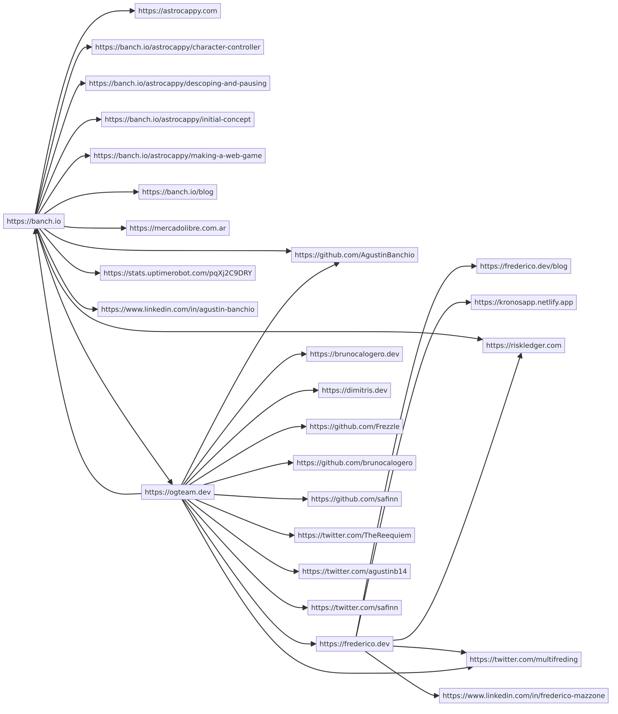

# Crawler

Generic crawler for any kind of "web" where locations link to other locations, or "network" where nodes link to other nodes.

Includes implementation for the most common crawler, the (world wide) web crawler.

## Usage

See [main.go](main.go) for an example that uses the `WebCrawler` implementation, or do `make run && make flowchart` which will create a nice diagram:

## Architecture

Divided into:
- Fetcher; fetches content from a location.
    - e.g. the WebFetcher fetches the HTML content from a URL.
- Parser; parses content to find other unique locations links.
    - e.g. the WebParser parses HTML content and finds all the `<a href="...">` links.
- Crawler; progressively crawls some seed location(s), and any location(s) it links to, and so on.

## Crawl any web or network

You can implement the `Fetcher` and/or `Parser` interfaces and use those implementation with the `Crawler`, allowing you to crawl other kinds of webs, e.g.:
- Crawl networks modelled in your database, where one network node links to other nodes.
- Creating a parser that looks for other things on the web page instead of anchor links.
- Creating a fetcher that supports single-page apps (SPAs) where the initial content is not yet populated/hydrated.

## Possible improvements

- include seed URLs in diagram even if they don't link to anywhere else
- optimise mermaid file output by not repeating the name of same web pages; if nodes can be defined separately from connections then we get the above^ TODO for free!
- concurrent crawling for better performance / more awesomeness
- interactive crawling e.g. interactive mermaid diagram where you click to expand a node (is a go library good for this? would be easier as just a frontend app with JS crawling logic)
- check if a domain has a sitemap defined for new URLs to crawl
- check for robots.txt file to adhere to (to be a polite crawler = less likely to be blocked)
- make this crawler into a library so anyone can use with their own seed urls, config, interface implementations, etc.
- combine the fetcher and parser into one? since the fetcher is currently just feeding directly into the parser, and it's likely that if you make one custom you'll also use a custom other one, then it might not be needed to have fine control over both. Simpler API.
- allow specifying a "only crawl these links" options, which can't go together with the "dont crawl these links"(?)
- add ability to specify an OnCrawl function that gets executed whenever a location is crawled; would aid in crawling networks that require custom logic ... maybe use this to get URL connections for mermaid graph, or even the custom logging (with more handler funcs for different situations e.g. crawling, not crawling, etc), instead of having urlConnections returned? This could also be the way to get web page content (if needed) while crawling (e.g. if i wanted web page titles in my diagram instead of the URLs).